# SlimShady's ARR Setup Guide

This is a practical beginner guide for setting up `Sonarr`, `Radarr`, `Lidarr`, and `SABnzbd` for a German-friendly media workflow without letting the system turn into a chaos goblin.

It focuses on:

- `Sonarr` for series and anime
- `Radarr` for movies and anime movies
- `Lidarr` for music
- `SABnzbd` for Usenet downloads
- indexer strategy for German content
- language preference scoring
- file-size control
- safe downgrade workflows

This guide is based on a real-world setup that was tuned and tested live, not just copied from disconnected wiki pages.

## Latest Stability and Speed Notes

The setup behind this guide was refined further after heavier downgrade testing and queue troubleshooting.

The most useful real-world improvements were:

- `SABnzbd Direct Unpack = off`
- `SABnzbd connections = 14`
- `SABnzbd receive_threads = 4`
- `SABnzbd server timeout = 45`
- smaller `Radarr` and `Sonarr` downgrade waves instead of giant batch floods
- treating `480p` as a curated old-movie workflow instead of a mass automation lane

That combination made the live setup:

- more reliable
- less likely to jam in post-processing
- less likely to leave ghost `downloading` rows in ARR
- and slightly faster during normal download work

## Background and Personal Experience

This guide was not written from the perspective of a full-time software developer trying to impress other developers.

It was built from the perspective of someone who:

- has technical experience
- works mainly in security
- is comfortable troubleshooting systems
- but does not live inside `Sonarr`, `Radarr`, `Lidarr`, `SABnzbd`, and indexer APIs every day

That matters, because a lot of ARR documentation assumes:

- you already know the terminology
- you already understand the side effects of each setting
- and you enjoy reading four different wiki pages just to understand one checkbox

This guide tries to do the opposite.

It is meant to help someone who is technical, practical, and willing to learn, but who does not want to reverse-engineer the whole ARR ecosystem from scratch.

It also reflects a real setup journey that was improved step by step with the support of `OpenAI Codex`:

- testing indexers
- tuning priorities
- fixing import problems
- building language preference logic
- tightening quality and size settings
- and designing safe downgrade workflows without wrecking the library

So if you are not a developer by default, that is completely fine.

You do not need to be one to build a very strong ARR setup.
You just need:

- a practical guide
- a bit of patience
- and, if you want, a tool like `Codex` to help implement and verify the details

If you are non-technical or only lightly technical, the safest way to use this guide is:

- do it step by step
- use `OpenAI Codex` as your configuration assistant
- make one change at a time
- verify each change before moving on

## What This Setup Actually Includes

This guide does not assume a single app in isolation.

A practical home-media automation stack usually includes:

- `Sonarr` for series and anime series
- `Radarr` for movies and anime movies
- `Lidarr` for music and artist/album monitoring
- `SABnzbd` as the main Usenet downloader
- `Jackett` if you also want torrent indexers or mixed-source support
- one or more Usenet indexers for search and NZB retrieval
- `Plex` as the media server that watches the finished library and makes it available for playback

Optional but very useful additions:

- `Import Lists` in `Sonarr`, `Radarr`, and `Lidarr`
- `MDBList` as one of the easiest ways to build dynamic auto-import lists for movies and shows
- `Lidarr` import lists for music-oriented sources like `Last.fm` and `Headphones`
- `Jellyseerr` or similar request/discovery frontends
- `FlareSolverr` if some torrent sites behind `Jackett` need anti-bot handling

## Download Links

Core apps used in this guide:

| App | Purpose | Download |
| --- | --- | --- |
| `Sonarr` | TV series and anime automation | [sonarr.tv](https://sonarr.tv/#download) |
| `Radarr` | Movie and anime movie automation | [radarr.video](https://radarr.video/#download) |
| `Lidarr` | Music automation | [lidarr.audio](https://lidarr.audio/#download) |
| `SABnzbd` | Main Usenet downloader | [sabnzbd.org/downloads](https://sabnzbd.org/downloads) |
| `Jackett` | Torrent indexer bridge | [GitHub Releases](https://github.com/Jackett/Jackett/releases) |
| `Plex` | Media server and playback | [plex.tv/media-server-downloads](https://www.plex.tv/media-server-downloads/) |
| `FlareSolverr` | Optional helper for protected torrent sites | [GitHub Releases](https://github.com/FlareSolverr/FlareSolverr/releases) |

Optional:

| App | Purpose | Download |
| --- | --- | --- |
| `OpenAI Codex` | Optional configuration assistant and implementation copilot | [Codex overview](https://openai.com/academy/codex/) |
| `Jellyseerr` | Requests and discovery frontend | [GitHub](https://github.com/Fallenbagel/jellyseerr) |
| `Prowlarr` | Central indexer management across ARR apps | [prowlarr.com](https://prowlarr.com/) |

## How the Full Automation Flow Works

At a high level, the process looks like this:

1. You add a movie, series, artist, or album manually, or it gets added through an `Import List`
2. `Sonarr`, `Radarr`, or `Lidarr` checks your profiles, custom formats, language scoring, and indexers
3. The ARR app searches your configured sources
4. A matching NZB or torrent is sent to the download client
5. `SABnzbd` or your torrent client downloads and unpacks the release
6. the ARR app imports the file into the final library folder according to your naming, quality, and upgrade rules
7. `Plex` scans the library folders, scrapes metadata, and updates the libraries
8. The media is ready to watch or listen to without further manual work

Simple flow:

```mermaid
flowchart LR
    classDef source fill:#0f172a,stroke:#38bdf8,stroke-width:2px,color:#e0f2fe
    classDef arr fill:#172554,stroke:#60a5fa,stroke-width:2px,color:#dbeafe
    classDef search fill:#052e16,stroke:#4ade80,stroke-width:2px,color:#dcfce7
    classDef download fill:#3f2a00,stroke:#fbbf24,stroke-width:2px,color:#fef3c7
    classDef library fill:#3b0764,stroke:#c084fc,stroke-width:2px,color:#f3e8ff

    A["Discovery Layer<br/>MDBList (movies/shows) / Music Import Lists / Manual Add"] --> B["ARR Apps<br/>Sonarr / Radarr / Lidarr"]
    B --> C["Search Layer<br/>Usenet Indexers / Jackett"]
    C --> D["Download Layer<br/>SABnzbd / Torrent Client"]
    D --> E["Library Processing<br/>Import / Rename / Organize"]
    E --> F["Playback Layer<br/>Plex Library Scan"]
    F --> G["Ready to Watch / Listen"]

    class A source
    class B arr
    class C search
    class D download
    class E,F,G library
```

So yes, when the setup is working properly, it can become a fully automated pipeline:

- discover
- import
- download
- process
- rename
- organize
- scrape
- watch

That is the real goal of this stack.

## Import Lists and Auto-Discovery

One of the most useful advanced features is `Import Lists`.

With the right list source, you can automatically bring in:

- latest movies
- ongoing TV series
- seasonal anime
- artists and albums where supported
- curated watchlists

Then:

- the ARR apps monitor those items
- apply your quality and language rules
- download matching releases automatically
- and pass the finished files into your library

From there, `Plex` picks them up automatically and makes them available in the UI.

This is where the setup starts to feel less like a set of tools and more like a proper media pipeline.

## MDBList as the Discovery Layer

If you want a practical answer to:

- how do I keep movies and series flowing in automatically
- without manually curating everything inside ARR

then `MDBList` is one of the simplest answers.

Official MDBList docs support adding MDBList list URLs directly to:

- `Radarr`
- `Sonarr` version `4`

They do not document direct `Lidarr` support. In this setup, `MDBList` is the discovery layer for movies and shows, while `Lidarr` should use music-oriented import-list sources instead.

Sources:

- [MDBList Radarr docs](https://docs.mdblist.com/docs/howto/mdblist_to_radarr.html)
- [MDBList Sonarr docs](https://docs.mdblist.com/docs/third-party/sonarr)
- [MDBList home/docs](https://docs.mdblist.com/)
- [Lidarr features: import lists from Last.fm and Headphones](https://lidarr.org/)

### How it works in practice

In this setup:

- `MDBList` creates and maintains the dynamic discovery lists
- `Radarr` and `Sonarr` poll their import lists every `5 minutes`
- if a new movie or series appears on one of those lists, ARR adds it on the next import-list sync cycle
- after that, your normal quality profiles, language scoring, and indexer strategy take over

Current live sync behavior in this setup:

- `Sonarr Import List Sync = every 5 minutes`
- `Radarr Import List Sync = every 5 minutes`
- `Sonarr RSS Sync = every 15 minutes`
- `Radarr RSS Sync = every 30 minutes`

So the usual sequence is:

1. a title is added to an `MDBList` list
2. `Sonarr` or `Radarr` sees it within about `5 minutes`
3. the title gets added and monitored
4. ARR either searches immediately if configured that way, or picks it up via the normal RSS/search cycle
5. the downloader grabs it according to your existing rules
6. it gets imported and lands in `Plex`

### Recommended MDBList sample lineup

Here is a practical example of how you can structure MDBList-driven discovery lanes:

#### For Radarr

- `Auto Cinema Anticipated 2026+`
  - purpose: upcoming or highly anticipated cinema-focused movies from `2026` onward
  - ARR role: feed future theatrical movie candidates into `Radarr`
- `Auto Cinema + Anime Best Rated 2025+`
  - purpose: highly rated modern movies, including anime films, from `2025` onward
  - ARR role: quality-focused discovery for `Radarr`
- `Auto Anime Best Rated 2020+ (Track)`
  - purpose: top-rated anime movie-style entries or anime-heavy titles from `2020` onward
  - ARR role: anime-leaning movie discovery for `Radarr`
- `Auto Streaming Best Rated 2025+`
  - purpose: strong streaming-first movie releases from `2025` onward
  - ARR role: catch digital/streaming titles early through `Radarr`

#### For Sonarr

- `Auto Series Anticipated 2026+`
  - purpose: anticipated upcoming series beginning in `2026` and later
  - ARR role: future show pipeline for `Sonarr`
- `Auto Series Best Rated 2025+`
  - purpose: top-rated newer series from `2025` onward
  - ARR role: higher-quality TV discovery for `Sonarr`
- `Auto Upcoming Anime 2026+`
  - purpose: upcoming anime series from `2026` onward
  - ARR role: anime discovery lane for `Sonarr`

### What happens when a new item appears on a list

If one of those lists gains a new movie or show:

- `Radarr` or `Sonarr` notices it on the next list sync
- the item is added with the root folder, quality profile, and monitoring behavior tied to that list
- it becomes part of your normal automation workflow
- ARR then applies:
  - custom formats
  - language scoring
  - size limits
  - indexer priorities
  - download client categories
- the item eventually downloads and imports if a matching release is found

In plain English:

- `MDBList` decides what is worth tracking for movies and shows
- music discovery should come from `Lidarr`-friendly music sources
- ARR decides how to download it
- `Plex` decides how to present it

That division of labor is one of the cleanest ways to keep the stack understandable.

## Quick Start

If you only want the short version:

- `Sonarr`: prefer `720p`, allow `1080p` fallback, use compact TV size limits
- `Radarr`: prefer compact `1080p`, disable `1080p remux` in the main profile
- `Lidarr`: use it for artists and albums, with its own quality and metadata flow
- `SABnzbd`: enable `Ignore samples`, clean junk files, blacklist executable extensions, keep `Direct Unpack` off, and use modestly tuned server settings
- `NinjaCentral`: daily Usenet workhorse
- `NZBFinder`: strong secondary source with meaningful German coverage
- `NZB.su`: solid fallback
- `SceneNZBs`: German specialist, but preserve its quota

## Use Codex as a Setup Copilot

If you do not want to work through all of this manually, you can use `OpenAI Codex` to help with the configuration and implementation.

For non-technical users, this is usually the best path:

- open this guide
- hand one section at a time to `Codex`
- ask it to explain the step in plain English
- let it implement or verify the configuration change
- review the result before continuing

Useful official links:

- [What is Codex?](https://openai.com/academy/what-is-codex)
- [Codex overview and getting started](https://openai.com/academy/codex/)
- [Introducing the Codex app](https://openai.com/index/introducing-the-codex-app/)

Practical use cases:

- inspect your current `Sonarr`, `Radarr`, `Lidarr`, and `SABnzbd` configuration
- compare your setup against this guide
- apply recommended changes step by step
- test indexers and priorities
- tune language scoring, size caps, and downgrade workflows
- troubleshoot strange ARR behavior

In other words:

- you can use this guide as the blueprint
- and use `Codex` to implement the setup into your own `Sonarr`, `Radarr`, and `Lidarr` environment accordingly

If you are not comfortable doing the configuration by hand, that is not a weakness. It is exactly the kind of situation where a step-by-step Codex workflow makes the project much easier and much less chaotic.

That is often much easier than manually clicking through every ARR screen and hoping you did not accidentally teach your indexers to download interpretive nonsense.

## Repository Guide

This repository is split into a few simple pages:

- [Main Guide](README.md)
- [Setup Checklist](docs/setup-checklist.md)
- [Sonarr Setup and Workflows](docs/sonarr-setup-and-workflows.md)
- [Radarr Setup and Workflows](docs/radarr-setup-and-workflows.md)
- [SABnzbd Tuning and Reliability](docs/sabnzbd-tuning-and-reliability.md)
- [Indexers and German Content Strategy](docs/indexers-and-german-content.md)
- [Quality, Sizes, and Downgrades](docs/quality-sizing-and-downgrades.md)

## Table of Contents

1. [First Principles](#1-first-principles)
2. [German Content Strategy](#2-german-content-strategy)
3. [Recommended Usenet Indexer Priority](#3-recommended-usenet-indexer-priority)
4. [SABnzbd Settings Worth Enabling](#4-sabnzbd-settings-worth-enabling)
5. [Sonarr Language Preference Setup](#5-sonarr-language-preference-setup)
6. [Radarr Language Preference Setup](#6-radarr-language-preference-setup)
7. [Prefer 720p for Series, 1080p for Movies](#7-prefer-720p-for-series-1080p-for-movies)
8. [Size Limits That Actually Make Sense](#8-size-limits-that-actually-make-sense)
9. [Safe Downgrade Workflow](#9-safe-downgrade-workflow)
10. [What We Learned from Testing Stargate](#10-what-we-learned-from-testing-stargate)
11. [Bulk Search and Quota Safety](#11-bulk-search-and-quota-safety)
12. [What to Watch For](#12-what-to-watch-for)
13. [Recommended Beginner Setup](#13-recommended-beginner-setup)
14. [Final Advice](#14-final-advice)

## 1. First Principles

- Use `Sonarr` for `TV series` and `anime series`
- Use `Radarr` for `movies` and `anime movies`
- Use `Lidarr` for `music`
- Use `SABnzbd` as the primary downloader for Usenet
- Use `Jackett` if you want torrent indexers in the same ecosystem
- Use `Plex` to serve and scrape the completed media library
- Use torrents only as a fallback if needed
- Keep your library and completed download folders on the same drive if you want hardlinks to work efficiently

Recommended path philosophy:

- downloads and imports on the same filesystem
- separate categories for each ARR app
- avoid mixing library folders with download folders

Example categories:

- `tv` for `Sonarr`
- `movies` for `Radarr`
- `music` for `Lidarr`

Also make sure:

- your download client categories match what `Sonarr`, `Radarr`, and `Lidarr` expect
- your final library folders are the same folders `Plex` watches
- `Completed Download Handling` is enabled in the ARR apps

## 2. German Content Strategy

For German-friendly setups, not all indexers are equal.

### Practical indexer roles

- `SceneNZBs`: strongest specialist for German releases, but limited by a strict daily/rolling grab quota
- `NZBFinder`: very good broad indexer with meaningful German coverage
- `NinjaCentral`: strong broad workhorse with a high quota, but less German-specialized
- `NZB.su`: solid fallback indexer with broad coverage

### Recommended indexer mindset

Use broad indexers for normal traffic.

Reserve the German specialist for releases where it really matters.

That means:

- use `NinjaCentral` and `NZBFinder` as your main daily search sources
- let `NZB.su` act as fallback
- keep `SceneNZBs` available for German-specific wins, but do not burn its quota on bulk jobs

## 3. Recommended Usenet Indexer Priority

In Servarr apps, indexer priority uses:

- `1` = highest priority
- `50` = lowest priority

Important:

- priority is only a tiebreaker
- all enabled indexers are still searched

### Suggested priority order

For `Sonarr` and `Radarr`:

- `NinjaCentral = 15`
- `NZBFinder = 18`
- `NZB.su = 30`
- `SceneNZBs = 45`

Why:

- `NinjaCentral` has high quota and good breadth
- `NZBFinder` has better German usefulness than a generic broad source
- `NZB.su` is still useful, but less important once the first two are present
- `SceneNZBs` is too valuable to waste on high-volume background work

## 4. SABnzbd Settings Worth Enabling

Best immediate settings:

- `Ignore samples = enabled`
- `Cleanup List = nfo, sfv, srr, txt, jpg, jpeg, png, url`
- `Unwanted extensions = exe, com, cmd, bat, scr, pif`
- `Unwanted extensions mode = blacklist`
- `Direct Unpack = off`
- `Connections = 14` on the main server as a safe tuned starting point
- `Receive Threads = 4`
- `Server Timeout = 45`

Why:

- sample files can interfere with manual imports and clutter
- junk metadata files add no value to media libraries
- executable files in media downloads are at best useless and at worst suspicious
- disabling `Direct Unpack` reduced queue and post-processing weirdness in live testing
- a small connection bump improved speed without turning SAB back into a forklift accident
- lowering timeout from `60` to `45` made SAB a bit less patient with hanging article fetches without making it twitchy

## 5. Sonarr Language Preference Setup

Do not trust `MULTi` alone as proof of German audio.

`MULTi` is only a weak signal.

### Recommended preference order

For the universal `Sonarr` setup used here:

1. confirmed `German + Japanese` proven multi-audio
2. confirmed `German audio`
3. `English audio`
4. weak `multi-audio`
5. `Japanese audio + German subtitles`
6. other fallbacks

### Important principle

Do not rely on Sonarr’s parser language label alone for scoring.

Use custom formats and title logic instead.

### Recommended Sonarr custom formats

- `Language - German Parser Signal`
- `Language - German Title Terms`
- `Language - Dual Multi Audio`
- `Language - English Audio Fallback`
- `Language - Original Audio Fallback`
- `Language - Japanese Audio Fallback`
- `Subs - German Subtitles`
- `Subs - English Subtitles`
- `Language - German Japanese Proven Multi Audio`

### Suggested Sonarr scores

- `German Parser Signal = 0`
- `German Title Terms = 1600`
- `German Japanese Proven Multi Audio = 600`
- `English Audio Fallback = 500`
- `Dual Multi Audio = 300`
- `German Subtitles = 180`
- `English Subtitles = 120`
- `Japanese Audio Fallback = 50`
- `Original Audio Fallback = 75`

### Sonarr profile rules

Apply to all quality profiles:

- `upgradeAllowed = true`
- `minFormatScore = 0`
- `cutoffFormatScore = 1000`
- `minUpgradeFormatScore = 1`

## 6. Radarr Language Preference Setup

Use the same philosophy in `Radarr` as in `Sonarr`.

Recommended order:

1. confirmed `German + Japanese` proven multi-audio
2. confirmed `German audio`
3. `English audio`
4. weak `multi-audio`
5. `Japanese + German subtitles`

### Important Radarr rule

Set the built-in profile language to:

- `Any`

This prevents false trust in parser guesses like:

- `MULTi` accidentally being treated as confirmed `German`

## 7. Prefer 720p for Series, 1080p for Movies

Recommended default philosophy:

- `Series`: prefer `720p`, allow `1080p` fallback
- `Movies`: prefer compact `1080p`

### Sonarr profile behavior

For a normal series profile:

- put `720p` above `1080p`
- keep `1080p` checked as fallback
- use a delay profile if you want to wait for `720p` before grabbing `1080p`

Recommended delay for `720p-first` shows:

- `Usenet delay = 120 minutes`
- `Torrent delay = 180 minutes`

Apply only to tagged `720p-first` series, not globally.

## 8. Size Limits That Actually Make Sense

### Radarr movie sizes

Goal:

- good-looking `1080p`
- not giant remuxes
- manual exceptions for very large premium releases

Recommended:

- disable `Remux-1080p` in main movie profile

`1080p`:

- `preferred = 50`
- `max = 60`

`720p`:

- `HDTV-720p = preferred 18, max 35`
- `WEBDL-720p = preferred 18, max 35`
- `WEBRip-720p = preferred 20, max 35`
- `Bluray-720p = preferred 20, max 35`

Later live testing justified a slightly looser movie `720p` ceiling:

- `HDTV-720p = preferred 18, max 45`
- `WEBDL-720p = preferred 18, max 45`
- `WEBRip-720p = preferred 20, max 45`
- `Bluray-720p = preferred 20, max 45`

Why:

- the original stricter cap rejected some perfectly reasonable long-movie `720p` releases
- `45` still keeps things sane while giving runtime-heavy titles enough breathing room

### Sonarr episode sizes

Recommended:

`720p`:

- `HDTV-720p = preferred 14, max 28`
- `WEBDL-720p = preferred 14, max 28`
- `WEBRip-720p = preferred 16, max 30`
- `Bluray-720p = preferred 16, max 30`

`1080p`:

- `HDTV-1080p = preferred 22, max 38`
- `WEBDL-1080p = preferred 22, max 38`
- `WEBRip-1080p = preferred 24, max 42`
- `Bluray-1080p = preferred 24, max 42`

These values are much more realistic than the loose defaults if your goal is compact files.

## 9. Safe Downgrade Workflow

Downgrading is where people usually manage to save disk space and accidentally create a fresh new mess.

### Radarr downgrade workflow

Create a separate profile:

- `HD 720p downgrade`
- optional stricter old-cinema profile: `SD 480p downgrade`

Rules:

- prefer `720p`
- allow `1080p` fallback
- do not use it as your main profile

Use it only for:

- oversized existing movies
- low-priority or non-favorite titles
- small test batches first

Recommended workflow:

1. assign `HD 720p downgrade` to a small batch
2. run `Search Selected`
3. review imports
4. repeat if the results look good

Practical update from live testing:

- `720p downgrade` works well as a semi-automated bulk lane
- `480p downgrade` works better as a curated/manual lane for older films
- once a movie lands on a compact `480p`, `DVD`, or otherwise intentionally tiny replacement you want to keep, unmonitoring it is the cleanest way to stop ARR from "improving" it again later

### Sonarr downgrade workflow

If you create a `720p downgrade` lane in Sonarr, make it codec-aware.

Why:

- naive `1080p -> 720p` downgrades can increase size if the old file is compact `x265` and the new one is bloated `x264`

Recommended Sonarr downgrade extras:

- `Codec - HEVC x265 Bonus`
- `Codec - AVC x264 Penalty`

Suggested scores:

- `HEVC x265 Bonus = +2000`
- `AVC x264 Penalty = -2000`
- `minFormatScore = 1700`

This makes the downgrade profile behave more like:

- “save space”

and less like:

- “download lower resolution but somehow larger files”

## 10. What We Learned from Testing Stargate

`Stargate SG-1` was a great test case.

It showed that:

- `720p` does not always save space
- codec matters as much as resolution
- some old `1080p x265` files are already more compact than many `720p x264` replacements

Lesson:

- do not assume `720p` automatically means smaller
- always think in terms of `resolution + codec + bitrate + audio tracks`

## 11. Bulk Search and Quota Safety

Do not bulk-search everything at once unless you enjoy fighting with rate limits for sport.

### Good batch sizes

For movies:

- `10-20` at a time

For TV episodes:

- `5-10` at a time

### Why this matters

Some indexers, especially German specialists, have strict rolling-grab limits.

If you burn those limits in one burst:

- searches still work
- grabs fail with `429 Too Many Requests`
- Sonarr/Radarr temporarily disable the indexer

That is not a bug.

That is the indexer telling you to calm down.

There is a second reason to stay small:

- large downgrade waves magnify bad releases
- one corrupt archive can poison post-processing and confuse ARR queue state
- the downloader and import chain stay much happier when you move in controlled waves instead of a heroic migration of `200` movies at once

## 12. What to Watch For

### Sample files

Use SAB’s `Ignore samples`.

### Downloader cleverness

Do not assume every SAB speed feature is worth enabling.

In this live setup, stability improved when:

- `Direct Unpack` was turned off
- SAB was allowed to finish a download cleanly before unpacking it

It was a little less flashy and a lot less haunted.

### Split or multipart movie releases

Avoid releases with:

- `Teil 1`
- `Part 1`
- `CD1`
- `Disc 1`

These often trigger manual import headaches.

### Suspicious broad matches

If an indexer starts returning weird or irrelevant matches:

- test a few representative titles manually
- compare against your other indexers
- lower its priority if it adds more noise than value

## 13. Recommended Beginner Setup

If you want a simple starting point:

### Sonarr

- profile: `720p-first, 1080p fallback`
- German-aware custom format scoring
- delay profile for `720p-first` shows
- compact episode size caps

### Radarr

- profile: compact `1080p`
- `Remux-1080p` disabled
- German-aware custom format scoring
- separate `720p downgrade` profile for oversized movies only

### Lidarr

- use it to automate artists, albums, and music library imports
- keep its download category separate from TV and movies
- let it handle music naming and organization instead of forcing music into the video ARR apps

### SABnzbd

- ignore samples
- clean junk files
- block executable extensions

### Jackett

- only add the torrent indexers you actually want
- keep flaky sources under control
- use `FlareSolverr` if specific sites need anti-bot handling

### Plex

- point Plex at the final movie and series library folders
- let `Sonarr` and `Radarr` handle naming and organization
- let Plex handle scraping, library presentation, and playback

### Indexers

- `NinjaCentral` for daily work
- `NZBFinder` as broad secondary source with decent German value
- `NZB.su` as fallback
- `SceneNZBs` for German-specialist coverage

## 14. Final Advice

Do not optimize everything at once.

The best ARR setups are built like this:

1. change one thing
2. test real titles
3. look at actual imports
4. then tune again

That is slower than random checkbox enthusiasm, but much less likely to end with your server downloading worse files more expensively.

## Sources and Inspiration

- [PCJones Usenet Guide](https://github.com/PCJones/usenet-guide#2-usenet-indexer)
- Servarr docs for `Sonarr`, `Radarr`, and indexer priorities
- real-world ARR tuning and live testing

## More Sources and Inspiration

This guide was shaped by a mix of:

- official `Servarr` documentation
- public `Newznab` and indexer capability endpoints
- public Usenet and indexer discussions
- hands-on testing inside a real `Sonarr` / `Radarr` / `SABnzbd` setup
- practical debugging of quota limits, failed grabs, language mismatches, and import problems

In other words:

- part documentation
- part experimentation
- part cleanup after ARR tools did something “technically logical” and practically ridiculous

The personal experience behind this guide matters a lot:

- it was not assembled as a theoretical best-practices checklist
- it was built while solving real issues in a live setup
- and it was refined with the help of `OpenAI Codex`, which was used to inspect, verify, compare, implement, and explain configuration changes step by step

That combination is exactly why this guide is more operational than most generic setup guides.
