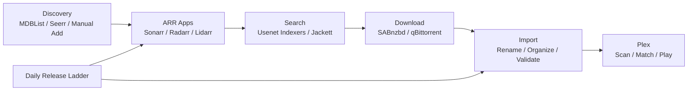

  

  <h2>Chapter 1: Start Here</h2>
  
This chapter explains the goal of the setup, the moving parts, and the order you should follow before touching advanced language or archive rules.

  

    Big picture first
    Beginner path
    Advanced path
    Stack map
  

  <a href="/slimshadys-arr-setup-guide/">Home</a>
  <a href="/slimshadys-arr-setup-guide/docs/chapter-02-base-setup.html">Next chapter</a>
  <a href="/slimshadys-arr-setup-guide/docs/index.html">All docs</a>

## What This Setup Is

This guide builds a home-media automation stack around:

- `Sonarr` for TV and anime series
- `Radarr` for movies and anime movies
- `Lidarr` for music
- `SABnzbd` as the main Usenet downloader
- `Jackett` as optional torrent fallback
- `Plex` as the final playback library
- `Seerr` as an optional request and discovery frontend

It is written from the perspective of a Swiss movie aficionado who cares about two things at the same time:

- preserving original movie versions, original audio, and proper multi-language releases
- making movies and series easy for family to watch in their native language

The goal is not just “download things automatically.”

The goal is:

- clean folders
- predictable imports
- German-friendly language behavior
- compact archive files
- safe fallback when German is not available yet
- fewer bad surprises from parser guesses, wrong titles, and weird language releases

## Swiss Private-Use Context

This guide assumes Swiss private use.

In Switzerland, private use is treated differently from public redistribution. The Swiss Federal Institute of Intellectual Property explains that downloading or streaming works for private use is allowed, including from illegal sources, but uploading or making works available online is not allowed. Article 19 of the Swiss Copyright Act defines private use to include personal use and use within a circle of closely connected people such as relatives or friends.

That means the setup described here is framed around private Swiss media use, original-version preservation, and family viewing. It is not a guide for public distribution, commercial sharing, uploading, or running an open media service.

Sources:

- [Swiss Federal Institute of Intellectual Property: Copyright on the internet](https://www.ige.ch/en/protecting-your-ip/copyright/using-a-work/copyright-on-the-internet)
- [Fedlex: Federal Act on Copyright and Related Rights, Art. 19 Private use](https://www.fedlex.admin.ch/eli/cc/1993/1798_1798_1798/en)

## The Reader Path

Use this order:

1. Build the base stack.
2. Confirm one movie and one episode can download, import, rename, and appear in Plex.
3. Add discovery and request tools.
4. Apply German-friendly and multi-language rules.
5. Apply archive and size rules.
6. Add the daily release-ladder automation.
7. Use the app reference pages when a specific tool needs fixing.

Do not begin with the clever parts. A sharp language profile on top of broken download folders is still broken, just wearing a nicer hat.

## Stack Flow

## Core Rules

- Let ARR own naming and importing.
- Let Plex scan final library folders only.
- Use English fallback as a temporary bridge, not a final winner.
- Let German/Multi replace English even across normal quality-tier boundaries.
- Keep original-language lanes scoped to anime, Korean, and Chinese content.
- Unmonitor verified final-state keepers.
- Keep request approval manual for large requests.

## Continue

Next: [Chapter 2: Base Setup Step by Step](/slimshadys-arr-setup-guide/docs/chapter-02-base-setup.html)
