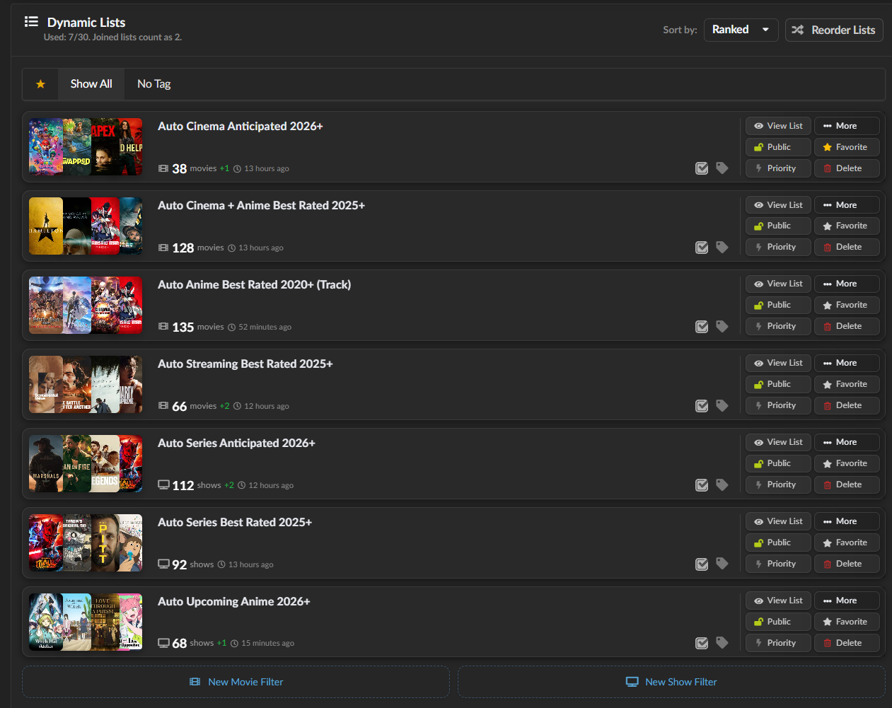

# MDBList Import Lists

This page explains why `mdblist.com` is one of the easiest ways to automate discovery for `Radarr` and `Sonarr`, and how it fits into the rest of the ARR stack.

## Why MDBList is Useful

`MDBList` is a dynamic list builder.

Instead of manually adding every new movie or show inside `Radarr` or `Sonarr`, you can:

- define the type of content you want
- let `MDBList` keep the list fresh
- let ARR import that list automatically

That makes `MDBList` the discovery layer, while ARR remains the automation and download layer.

## Official Compatibility

Official MDBList docs say you can add MDBList list URLs directly to:

- `Radarr`
- `Sonarr` version `4`

Sources:

- [MDBList to Radarr](https://docs.mdblist.com/docs/howto/mdblist_to_radarr.html)
- [MDBList Sonarr integration](https://docs.mdblist.com/docs/third-party/sonarr)
- [MDBList overview](https://docs.mdblist.com/)

## How ARR Uses the Lists

In the current live setup:

- `Sonarr Import List Sync` runs every `5 minutes`
- `Radarr Import List Sync` runs every `5 minutes`

That means when a new title is added to one of your `MDBList` lists:

1. ARR sees it on the next import-list sync
2. the movie or series is added to the correct library
3. ARR applies your normal root-folder, profile, monitoring, and language rules
4. RSS or search logic takes over and looks for matching releases
5. the downloader grabs the release
6. ARR imports it and `Plex` picks it up

In this live setup, the related background timing is:

- `Sonarr RSS Sync = every 15 minutes`
- `Radarr RSS Sync = every 30 minutes`

So list import is fast, and grabbing follows your existing search/RSS behavior.

## Your Current MDBList Lineup

The lists you showed break down nicely into movie and TV lanes.

The descriptions below are based on the current list names and intended use. The exact filter logic still lives inside `MDBList`, so if you later tighten or broaden a filter there, the list behavior changes without you having to rewrite ARR itself.

_Example of the current `MDBList` dynamic-list dashboard used in this setup._

## Quick List Overview

| List | ARR App | What it is for | What happens when it updates |
| --- | --- | --- | --- |
| `Auto Cinema Anticipated 2026+` | `Radarr` | upcoming cinema-focused movies from `2026` onward | new movie is added to `Radarr`, monitored, then handled by your normal movie rules |
| `Auto Cinema + Anime Best Rated 2025+` | `Radarr` | highly rated modern movies including anime films | new movie is imported, then your language, quality, and size rules decide what gets grabbed |
| `Auto Anime Best Rated 2020+ (Track)` | `Radarr` | anime-heavy movie discovery from `2020` onward | new title enters `Radarr` and follows your anime-friendly movie logic |
| `Auto Streaming Best Rated 2025+` | `Radarr` | strong streaming-first movie discovery | new title lands in `Radarr` quickly and follows the compact `1080p` movie setup |
| `Auto Series Anticipated 2026+` | `Sonarr` | anticipated new shows from `2026` onward | new series is added to `Sonarr` and monitored under your TV rules |
| `Auto Series Best Rated 2025+` | `Sonarr` | highly rated newer series | new series enters `Sonarr` and follows your `720p`-first series setup |
| `Auto Upcoming Anime 2026+` | `Sonarr` | upcoming anime series | new anime series is added to `Sonarr` and handled by your anime/series rules |

### Radarr Lists

#### Auto Cinema Anticipated 2026+

- purpose: anticipated cinema-oriented movies from `2026` onward
- best use: keep `Radarr` aware of upcoming theatrical titles early
- behavior: new titles added to this list are imported by `Radarr` on the next list sync and then monitored under your normal movie rules

#### Auto Cinema + Anime Best Rated 2025+

- purpose: highly rated modern movies from `2025` onward, including anime films
- best use: quality-focused movie discovery instead of raw popularity chasing
- behavior: new titles feed into `Radarr` as soon as they appear, then your language and size rules decide what gets grabbed

#### Auto Anime Best Rated 2020+ (Track)

- purpose: strong anime-heavy movie discovery from `2020` onward
- best use: keep a dedicated anime-friendly movie lane without mixing everything into one giant general list
- behavior: `Radarr` imports new entries, then your movie custom formats decide whether German, English, or multi-audio releases win

#### Auto Streaming Best Rated 2025+

- purpose: strong streaming-first or digital-first movie titles from `2025` onward
- best use: catch platform-driven releases faster than waiting for theatrical-only discovery
- behavior: new entries move into `Radarr`, where your compact `1080p` and language rules take over

### Sonarr Lists

#### Auto Series Anticipated 2026+

- purpose: anticipated TV series starting in `2026` and later
- best use: build a future pipeline of shows you want `Sonarr` to monitor automatically
- behavior: when a new show appears, `Sonarr` imports it on the next sync and applies your series profile and language rules

#### Auto Series Best Rated 2025+

- purpose: highly rated newer series from `2025` onward
- best use: a quality-first TV discovery lane
- behavior: new entries are added to `Sonarr`, then your `720p`-first and fallback logic handles the eventual downloads

#### Auto Upcoming Anime 2026+

- purpose: upcoming anime series from `2026` onward
- best use: give `Sonarr` a dedicated anime discovery stream
- behavior: once imported, the show follows your Sonarr anime/series handling, language scoring, and delayed `720p` strategy

## What Happens When a List Updates

If an `MDBList` dynamic list gains a new item:

- ARR notices it on the next import-list sync
- the item is added to your library in a monitored state
- future grabs are controlled by:
  - quality profiles
  - custom formats
  - language scoring
  - indexer priorities
  - downloader categories

So `MDBList` does not replace ARR logic.

It feeds ARR better input.

That is exactly why it works so well in a beginner-friendly setup.

## Why This is Simpler Than Manual Adding

Without `MDBList`, you often have to:

- search for new titles manually
- decide what belongs in `Sonarr` vs `Radarr`
- keep checking release calendars yourself

With `MDBList`:

- the list stays alive on its own
- ARR keeps importing new entries
- your existing rules keep everything consistent

It is one of the cleanest ways to build a mostly automated media pipeline without making the setup feel like a second job.

## Recommended Operating Model

Use `MDBList` to answer:

- what should be tracked

Use `Sonarr`, `Radarr`, and `Lidarr` to answer:

- how should it be downloaded

Use `Plex` to answer:

- how should it be presented

That separation makes the stack much easier to understand and maintain.
