

  

  

    6
    Core apps in the stack
  

  

    10
    Deep-dive guide sections
  

  

    14
    SAB connections tuned
  

  

    45s
    Downloader timeout baseline
  

  <h2>What this guide is about</h2>
  
This site is a practical beginner-friendly walkthrough for building a mostly automated media setup with <code>Sonarr</code>, <code>Radarr</code>, <code>Lidarr</code>, <code>SABnzbd</code>, <code>Jackett</code>, and <code>Plex</code>.

  
It focuses on smarter quality rules, safer quotas, cleaner storage, and the kind of real-world fixes you only learn after ARR tools do something deeply confident and slightly cursed.

  

    Guide traffic:
    
  

  

    <a href="/slimshadys-arr-setup-guide/docs/setup-checklist.html">Start with the checklist</a>
    <a href="/slimshadys-arr-setup-guide/docs/sonarr-setup-and-workflows.html">See Sonarr setup</a>
    <a href="/slimshadys-arr-setup-guide/docs/radarr-setup-and-workflows.html">See Radarr setup</a>
    <a href="/slimshadys-arr-setup-guide/docs/lidarr-setup-and-workflows.html">See Lidarr setup</a>
    <a href="/slimshadys-arr-setup-guide/docs/sabnzbd-tuning-and-reliability.html">See SAB tuning</a>
    <a href="/slimshadys-arr-setup-guide/docs/jackett-setup-and-workflows.html">See Jackett setup</a>
    <a href="/slimshadys-arr-setup-guide/docs/plex-setup-and-workflows.html">See Plex setup</a>
    <a href="/slimshadys-arr-setup-guide/docs/mdblist-import-lists.html">See MDBList automation</a>
    <a href="/slimshadys-arr-setup-guide/docs/indexers-and-german-content.html">See German-friendly strategy</a>
    <a href="/slimshadys-arr-setup-guide/docs/quality-sizing-and-downgrades.html">Review quality and sizes</a>
    <a href="https://github.com/Shadow2442/slimshadys-arr-setup-guide">Open the GitHub repo</a>
  

  <h3>What you get in this guide</h3>
  
This site is a practical beginner-friendly guide for the full stack and the rules around it:

  

    <code>Sonarr</code>
    <code>Radarr</code>
    <code>Lidarr</code>
    <code>SABnzbd</code>
    <code>Jackett</code>
    <code>Plex</code>
    regional language strategy
    language-aware automation
    size control
    safe downgrade workflows
  

  <h3>Latest live tuning that helped</h3>
  
The guide now reflects the newer, more stable configuration that behaved better in real testing:

  

    <code>SABnzbd Direct Unpack = off</code>
    <code>connections = 14</code>
    <code>receive_threads = 4</code>
    <code>timeout = 45</code>
    smaller downgrade waves
    curated 480p old-movie lane
  

  

    <h3>General setup first</h3>
    
The core docs stay broad on purpose so the main stack is easy to understand even if you are not building around one specific language or region.

  

  

    <h3>Storage-aware quality rules</h3>
    
Compact <code>1080p</code> movies, <code>720p</code>-first series, and downgrade workflows that actually save space instead of creating comedy.

  

  

    <h3>Regional strategy when you need it</h3>
    
If you want a German-friendly setup, there is a dedicated specialist page for language scoring, provider roles, and quota-aware source strategy.

  

## Download the Apps

These are the main applications used in this setup:

| App | Purpose | Download |
| --- | --- | --- |
| `Sonarr` | TV series and anime automation | [sonarr.tv](https://sonarr.tv/#download) |
| `Radarr` | Movie and anime movie automation | [radarr.video](https://radarr.video/#download) |
| `Lidarr` | Music automation | [lidarr.audio](https://lidarr.audio/#download) |
| `SABnzbd` | Main Usenet downloader | [sabnzbd.org/downloads](https://sabnzbd.org/downloads) |
| `Jackett` | Torrent indexer bridge | [GitHub Releases](https://github.com/Jackett/Jackett/releases) |
| `Plex` | Media server, scraping, and playback | [plex.tv/media-server-downloads](https://www.plex.tv/media-server-downloads/) |
| `FlareSolverr` | Optional helper for protected torrent sites | [GitHub Releases](https://github.com/FlareSolverr/FlareSolverr/releases) |

Optional but useful:

| App | Purpose | Download |
| --- | --- | --- |
| `OpenAI Codex` | Optional configuration assistant and implementation copilot | [OpenAI Academy](https://openai.com/academy/codex/) |
| `Jellyseerr` | Requests and discovery frontend | [GitHub](https://github.com/Fallenbagel/jellyseerr) |
| `Prowlarr` | Central ARR indexer management | [prowlarr.com](https://prowlarr.com/) |

## The Setup at a Glance

```mermaid
flowchart LR
    classDef source fill:#0f172a,stroke:#38bdf8,stroke-width:2px,color:#e0f2fe
    classDef arr fill:#172554,stroke:#60a5fa,stroke-width:2px,color:#dbeafe
    classDef search fill:#052e16,stroke:#4ade80,stroke-width:2px,color:#dcfce7
    classDef download fill:#3f2a00,stroke:#fbbf24,stroke-width:2px,color:#fef3c7
    classDef library fill:#3b0764,stroke:#c084fc,stroke-width:2px,color:#f3e8ff

    A["Discovery Layer<br/>MDBList (movies/shows) / Music Import Lists / Manual Add"] --> B["ARR Apps<br/>Sonarr / Radarr / Lidarr"]
    B --> C["Search Layer<br/>Usenet Indexers / Jackett"]
    C --> D["Download Layer<br/>SABnzbd / Torrent Client"]
    D --> E["Library Processing<br/>Import / Rename / Organize"]
    E --> F["Playback Layer<br/>Plex Library Scan"]
    F --> G["Ready to Watch / Listen"]

    class A source
    class B arr
    class C search
    class D download
    class E,F,G library
```

## What the Full Stack Does

This guide covers more than just choosing a few quality settings.

The real stack works like this:

- `Import Lists` or manual additions feed new movies, series, artists, and albums into the ARR apps
- the ARR apps search indexers using your rules
- the download client fetches the release
- the ARR apps import, rename, and organize the final files
- `Plex` scans the finished library and makes it available to watch or listen to

When everything is configured properly, it becomes a mostly automated media pipeline instead of a pile of separate tools.

## Who This Is For

This guide is especially useful if:

- you are technical, but not an ARR specialist
- you work in IT, security, or adjacent technical areas
- you are comfortable learning systems
- but you do not want to spend days decoding every Sonarr and Radarr setting from scratch

It is also useful if you are not especially technical, but are willing to:

- work step by step
- follow a practical checklist
- use `OpenAI Codex` as a setup assistant instead of trying to configure the whole stack from memory

It comes from real setup work done by someone with technical experience and a practical mindset, not from a developer-only perspective.

It was also built and refined with the support of `OpenAI Codex`, which helped inspect the live configuration, test ideas, compare indexers, and apply changes safely.

## Start Here

- [Full Guide on GitHub](https://github.com/Shadow2442/slimshadys-arr-setup-guide#readme)
- [Setup Checklist](/slimshadys-arr-setup-guide/docs/setup-checklist.html)
- [Sonarr Setup and Workflows](/slimshadys-arr-setup-guide/docs/sonarr-setup-and-workflows.html)
- [Radarr Setup and Workflows](/slimshadys-arr-setup-guide/docs/radarr-setup-and-workflows.html)
- [Lidarr Setup and Workflows](/slimshadys-arr-setup-guide/docs/lidarr-setup-and-workflows.html)
- [SABnzbd Tuning and Reliability](/slimshadys-arr-setup-guide/docs/sabnzbd-tuning-and-reliability.html)
- [Jackett Setup and Workflows](/slimshadys-arr-setup-guide/docs/jackett-setup-and-workflows.html)
- [Plex Setup and Workflows](/slimshadys-arr-setup-guide/docs/plex-setup-and-workflows.html)
- [MDBList Import Lists](/slimshadys-arr-setup-guide/docs/mdblist-import-lists.html)
- [Indexers and German Content Strategy](/slimshadys-arr-setup-guide/docs/indexers-and-german-content.html)
- [Quality, Sizes, and Downgrades](/slimshadys-arr-setup-guide/docs/quality-sizing-and-downgrades.html)

## MDBList and Auto-Import

`MDBList` is one of the easiest ways to build automated movie and TV discovery without maintaining giant manual watchlists by hand.

In this setup, it works like this:

- your `MDBList` dynamic lists act as the discovery layer for movies and shows
- `Radarr` and `Sonarr` poll those lists every `5 minutes` in the live reference setup used for this guide
- new items found on the list are added into the ARR app with your existing quality, language, and root-folder rules
- once added, they are monitored and then picked up by normal RSS/search behavior

For `Lidarr`, keep the same overall idea but use music-oriented import-list sources instead of `MDBList`.

That makes `MDBList` the front door of the automation chain for movies and shows, while ARR still controls the download rules and final library behavior.

## What This Guide Tries to Do

Most ARR guides explain features.

This one tries to answer:

- what should you actually enable
- what should you avoid
- how should you set priorities
- how do you adapt the stack for language-specific needs without burning through quotas
- how do you save disk space without downloading worse files by accident

## Want Help Applying It?

If you do not want to implement everything manually, you can use `OpenAI Codex` as a practical ARR setup copilot.

For non-technical users, this is often the easiest way to approach the project:

1. open one section of the guide
2. ask `Codex` to explain that section in plain English
3. let `Codex` help apply that exact step
4. verify the result
5. then move to the next section

This guide works well as input for Codex, for example if you want help to:

- audit your current `Sonarr`, `Radarr`, `Lidarr`, and `SABnzbd` setup
- apply the recommended indexer priorities
- implement language-scoring rules
- tune quality profiles and size limits
- build safe downgrade workflows
- debug import or search issues

So yes, this guide is not only meant to be read by humans. It can also be handed to `Codex` so it can help implement the configuration in your own setup.

## Short Version

- use broad indexers for daily work
- preserve specialist or quota-limited sources for when they matter
- prefer `720p` for series
- prefer compact `1080p` for movies
- treat downgrades as a controlled workflow, not a magic button

If a setting sounds too clever, test it on a few titles first. ARR tools are excellent at turning confidence into comedy.
