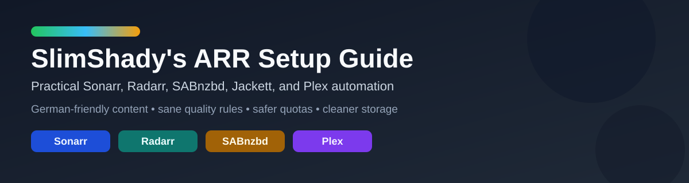
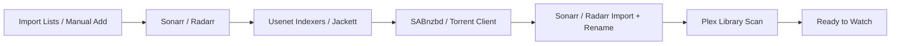

Welcome to the GitHub Pages version of this ARR setup guide.

This site is a practical beginner-friendly guide for:

- `Sonarr`
- `Radarr`
- `SABnzbd`
- `Jackett`
- `Plex`
- German-friendly indexer strategy
- language-aware automation
- size control
- safe downgrade workflows

## Download the Apps

These are the main applications used in this setup:

| App | Purpose | Download |
| --- | --- | --- |
| `Sonarr` | TV series and anime automation | [sonarr.tv](https://sonarr.tv/#download) |
| `Radarr` | Movie and anime movie automation | [radarr.video](https://radarr.video/#download) |
| `SABnzbd` | Main Usenet downloader | [sabnzbd.org/downloads](https://sabnzbd.org/downloads) |
| `Jackett` | Torrent indexer bridge | [GitHub Releases](https://github.com/Jackett/Jackett/releases) |
| `Plex` | Media server, scraping, and playback | [plex.tv/media-server-downloads](https://www.plex.tv/media-server-downloads/) |
| `FlareSolverr` | Optional helper for protected torrent sites | [GitHub Releases](https://github.com/FlareSolverr/FlareSolverr/releases) |

Optional but useful:

| App | Purpose | Download |
| --- | --- | --- |
| `Jellyseerr` | Requests and discovery frontend | [GitHub](https://github.com/Fallenbagel/jellyseerr) |
| `Prowlarr` | Central ARR indexer management | [prowlarr.com](https://prowlarr.com/) |

## The Setup at a Glance

## What the Full Stack Does

This guide covers more than just choosing a few quality settings.

The real stack works like this:

- `Import Lists` or manual additions feed new movies and series into `Sonarr` and `Radarr`
- the ARR apps search indexers using your rules
- the download client fetches the release
- the ARR apps import, rename, and organize the final files
- `Plex` scans the finished library and makes it available to watch

When everything is configured properly, it becomes a mostly automated media pipeline instead of a pile of separate tools.

## Who This Is For

This guide is especially useful if:

- you are technical, but not an ARR specialist
- you work in IT, security, or adjacent technical areas
- you are comfortable learning systems
- but you do not want to spend days decoding every Sonarr and Radarr setting from scratch

It comes from real setup work done by someone with technical experience and a practical mindset, not from a "developer-only" perspective.

It was also built and refined with the support of `OpenAI Codex`, which helped inspect the live configuration, test ideas, compare indexers, and apply changes safely.

## Start Here

- [Main Guide](README.md)
- [Setup Checklist](docs/setup-checklist.md)
- [Indexers and German Content Strategy](docs/indexers-and-german-content.md)
- [Quality, Sizes, and Downgrades](docs/quality-sizing-and-downgrades.md)

## What This Guide Tries to Do

Most ARR guides explain features.

This one tries to answer:

- what should you actually enable
- what should you avoid
- how should you set priorities
- how do you keep German content quality high without burning through quotas
- how do you save disk space without downloading worse files by accident

## Want Help Applying It?

If you do not want to implement everything manually, you can use `OpenAI Codex` as a practical ARR setup copilot.

This guide works well as input for Codex, for example if you want help to:

- audit your current `Sonarr`, `Radarr`, and `SABnzbd` setup
- apply the recommended indexer priorities
- implement language-scoring rules
- tune quality profiles and size limits
- build safe downgrade workflows
- debug import or search issues

So yes, this guide is not only meant to be read by humans. It can also be handed to `Codex` so it can help implement the configuration in your own setup.

## Short Version

- use broad indexers for daily work
- preserve German specialist sources for when they matter
- prefer `720p` for series
- prefer compact `1080p` for movies
- treat downgrades as a controlled workflow, not a magic button

If a setting sounds too clever, test it on a few titles first. ARR tools are excellent at turning confidence into comedy.
